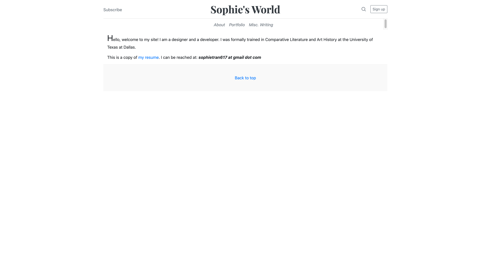
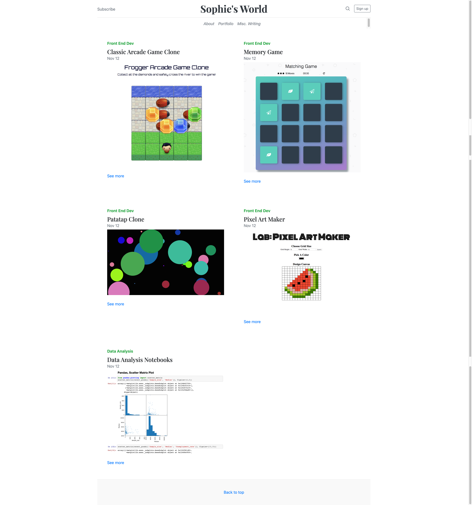

# Personal Blog Website

The project uses HTML, CSS, and Bootstrap to build the skeleton of a website. See it live here: https://thesophietran.github.io/Personal-Blog-Website/

<h2>About page</h2>

<h2>Portfolio page</h2>

<h2>Writing page</h2>

